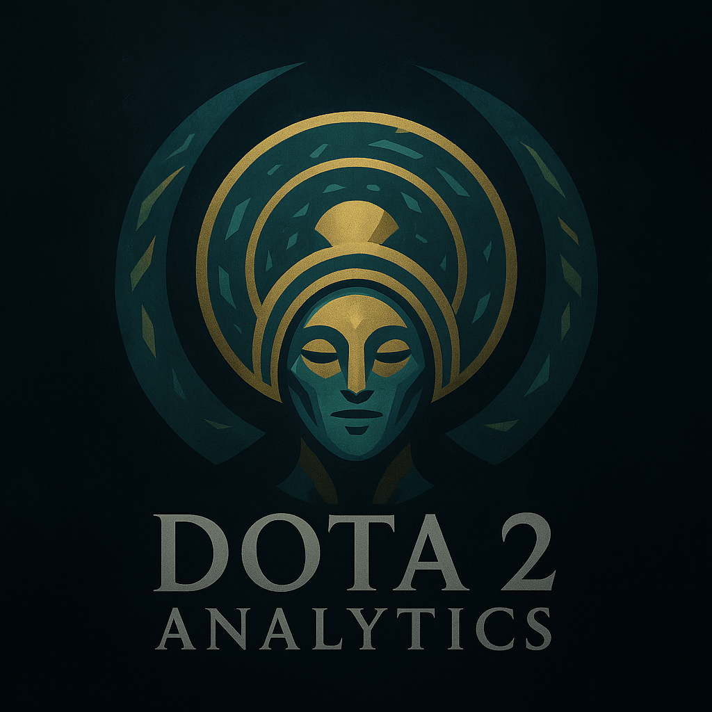

# Dota 2 Analytics Telegram Bot

<p align="center">
  
</p>

A Telegram bot that provides Dota 2 in-game statistics for heroes, including popular item builds and skill builds, based on user-selected rank and role. The bot fetches data from the Stratz API.

## Table of Contents

- [Features](#features)
- [User Flow](#user-flow)
  - [Screen 1: Rank Selection](#screen-1-rank-selection)
  - [Screen 2: Role Selection](#screen-2-role-selection)
  - [Screen 3: Hero List](#screen-3-hero-list)
  - [Screen 4: Build Type Selection](#screen-4-build-type-selection)
  - [Screen 5: Skill Build Display](#screen-5-skill-build-display)
  - [Screen 6: Item Build Display](#screen-6-item-build-display)
- [Technical Overview](#technical-overview)
  - [API Integration (Stratz)](#api-integration-stratz)
  - [State Management](#state-management)
  - [Data Fetching & Processing Logic](#data-fetching--processing-logic)
  - [Key Components and Their Roles](#key-components-and-their-roles)
- [System Parameters & Notes](#system-parameters--notes)
- [Setup and Installation](#setup-and-installation)
  - [Prerequisites](#prerequisites)
  - [Configuration](#configuration)
  - [Running the Bot](#running-the-bot)
- [Contributing](#contributing)
- [License](#license)

## Features

- **Rank-Based Statistics**: Users can select their Dota 2 rank (Herald to Immortal) to get relevant statistics.
- **Role-Specific Data**: Provides data tailored to specific in-game roles (e.g., Carry, Mid, Support).
- **Top Hero Suggestions**: Displays a list of top-performing heroes for the selected rank and role based on win rate.
- **Skill Builds**: Shows recommended ability leveling order (levels 1-9) and detailed per-level popularity and win rates for abilities.
- **Item Builds**: Provides popular item choices for different game stages:
  - Starting Items
  - Mid-Game Items (15-35 minutes, fetched using Stratz `itemFullPurchase`)
  - Late-Game Items (35-75 minutes, fetched using Stratz `itemFullPurchase`; 75 min is the API maximum for `maxTime`)
- **Interactive Interface**: Uses Telegram reply keyboards for easy navigation.
- **Real-time Data**: Fetches fresh data from the Stratz API.

## User Flow

The bot guides the user through a series of selections to get the desired hero build information.

### Screen 1: Rank Selection

- **Action**: The user starts the bot with the `/start` command or navigates "Home".
- **Display**: The bot prompts the user to select their rank using inline buttons.
  - Example Buttons: `HERALD`, `GUARDIAN`, `CRUSADER`, `ARCHON`, `LEGEND`, `ANCIENT`, `DIVINE`, `IMMORTAL`
- **Logic**:
  - The selected display rank (e.g., `IMMORTAL`) is saved to `userState[chatId].rankDisplayValue`.
  - The corresponding Stratz API value (e.g., `DIVINE_IMMORTAL`) is saved to `userState[chatId].rankApiValue` based on the mapping in `src/constants/gameConstants.js (RANK_BASIC_MAP)`.
    - `HERALD`, `GUARDIAN` → `HERALD_GUARDIAN`
    - `CRUSADER`, `ARCHON` → `CRUSADER_ARCHON`
    - `LEGEND`, `ANCIENT` → `LEGEND_ANCIENT`
    - `DIVINE`, `IMMORTAL` → `DIVINE_IMMORTAL`
- **Transition**: Proceeds to Screen 2: Role Selection.

### Screen 2: Role Selection

- **Action**: The user clicks a rank button.
- **Display**: The bot deletes the rank selection message and prompts for role selection with inline buttons.
  - Example Message: `Rank selected: Immortal. Now choose your role:`
  - Example Buttons: `🗡️ Carry`, `🗼 Mid Laner`, `🛡️ Offlaner`, `✨ Support (Pos 4)`, `💖 Hard Support (Pos 5)` (from `src/constants/gameConstants.js (POSITIONS)`)
- **Logic**:
  - The selected role key (e.g., `POSITION_1`) is saved to `userState[chatId].position`.
- **Transition**: Proceeds to Screen 3: Hero List.

### Screen 3: Hero List

- **Action**: The user clicks a role button.
- **Display**:
  - The bot deletes the role selection message.
  - A "🔄 Loading statistics for [Rank] / [Role]..." message is sent.
  - After data is fetched, the loading message is deleted.
  - The bot displays a formatted list of up to 10 top heroes for the selected rank, role, and for the "All Pick Ranked" game mode.
- **Example Hero List Message**:

  ```
  📊 Statistics for the last 8 days (All Pick Ranked)
  🎯 Rank: Immortal
  Role: 💖 Hard Support (Pos 5)

  1. Oracle
  📈 54.2% (7305 matches, last game July 15th)

  2. Vengeful Spirit
  📈 53.9% (3050 matches, last game July 15th)

  ... (up to 10 heroes)
  ```

- **Button Display**: The bot offers hero selection via inline buttons (hero names), along with "⬅️ Back (to roles)" and "🏠 Home" navigation buttons.
- **Logic**:
  - Hero list is fetched via `StratzService.fetchHeroStats()` (filtered by "All Pick Ranked" game mode) and processed by `DataProcessor.processHeroStats()`.
  - The processed list of heroes is saved to `userState[chatId].heroes`.
- **Transition**: Proceeds to Screen 4: Build Type Selection.

### Screen 4: Build Type Selection

- **Action**: The user clicks a hero name button.
- **Display**:
  - The bot deletes the hero list message.
  - A confirmation message for the selected hero is sent.
- **Example Confirmation Message**:
  ```
  ✅ Hero Oracle selected.
  Rank: Immortal, Role: 💖 Hard Support (Pos 5)
  ```
- **Button Display**: The bot offers build type selection via inline buttons: `📘 Skill Build`, `🎒 Item Build`. Navigation buttons "⬅️ Back (to heroes)" and "🏠 Home" are also provided.
- **Logic**:
  - The selected hero (an object `{ id, name }`) is saved to `userState[chatId].selectedHero`.
- **Transition**: Proceeds to Screen 5 (Skill Build) or Screen 6 (Item Build).

### Screen 5: Skill Build Display

- **Action**: The user clicks the "📘 Skill Build" button.
- **Display**:
  - The bot deletes the build type selection message.
  - A "🔄 Loading skill build for [Hero Name]..." message is sent.
  - After data is fetched, the loading message is deleted.
  - The bot displays the skill build for the selected hero, rank, and role.
- **Example Skill Build Message**:

  ```
  📘 Skill build for Oracle
  Rank: Immortal, Role: 💖 Hard Support (Pos 5)

  💡 Recommended skill order (most popular, levels 1-9):
  Q ➜ E ➜ Q ➜ W ➜ Q ➜ R ➜ Q ➜ E ➜ E

  📊 Detailed stats per level (top popular, non-talents):

  Level 1:
  • Fortune's End (Q) - 75.0% WR (1500 matches)
  • Fate's Edict (W) - 60.0% WR (500 matches)

  Level 2:
  • Purifying Flames (E) - 78.0% WR (1800 matches)
  ... (up to level 9)
  ```

- **Logic**:
  - Skill build data is fetched via `StratzService.fetchHeroAbilityBuildData()` and processed by `DataProcessor.processAbilityBuild()`.
- **Navigation**: After the skill build message, inline buttons for "🎒 Item Build", "⬅️ Back (to build selection)", and "🏠 Home" are shown.

### Screen 6: Item Build Display

- **Action**: The user clicks the "🎒 Item Build" button.
- **Display**:
  - The bot deletes the build type selection message (or skill build message if transitioning from there).
  - A "🔄 Loading item build for [Hero Name]..." message is sent.
  - After data is fetched, the loading message is deleted.
  - The bot displays the item build for the selected hero, rank, and role.
- **Example Item Build Message**:

  ```
  🎒 Item build for Oracle
  Rank: Immortal, Role: 💖 Hard Support (Pos 5)

  Starting Items:
  • Tango (95.0% WR, 3000 matches)
  • Healing Salve (80.5% WR, 2500 matches)
  • Clarity (70.0% WR, 2000 matches)

  Mid-Game Items (15-35 min):
  • Glimmer Cape (65.2% WR, 1800 matches)
  • Force Staff (60.1% WR, 1500 matches)

  Late-Game Items (35+ min):
  • Aether Lens (70.5% WR, 1200 matches)
  • Aeon Disk (55.0% WR, 900 matches)
  ```

- **Logic**:
  - Item build data is fetched via `StratzService.fetchItemBuild()`. This method uses:
    - `itemStartingPurchase` for starting items (does not use `minTime`, `maxTime`, or `matchLimit`).
    - `itemFullPurchase` for mid-game items with parameters: `minTime: 15` (minutes), `maxTime: 35` (minutes), and `matchLimit: 0`.
    - `itemFullPurchase` for late-game items with parameters: `minTime: 35` (minutes), `maxTime: 75` (minutes, API maximum), and `matchLimit: 0`.
    - The arguments `take` and `gameVersionIds` are **not** used for `itemFullPurchase` queries as they are not supported or lead to errors.
  - The fetched data is processed by `DataProcessor.processItemBuild()` to determine popular items for each category.
- **Navigation**: After the item build message, reply keyboard buttons for "📘 Скиллбилд", "⬅️ Назад (к выбору билда)", and "�� Домой" are shown.

## Technical Overview

This section provides a brief overview of the bot's architecture and technical details.

### API Integration (Stratz)

- **API Explorer**: [https://api.stratz.com/graphiql](https://api.stratz.com/graphiql)
- **Endpoint**: `https://api.stratz.com/graphql`
- **Authentication**: Uses a Bearer Token in the `Authorization` header (`Authorization: Bearer <STRATZ_API_TOKEN>`). The token is sourced from `src/config/config.js`.

### State Management

- User state is managed in-memory within the `userState` object in `src/index.js`.
- The `chatId` serves as the key for each user's state.
- **Example State Object (`userState[chatId]`)**:
  ```javascript
  {
    rankDisplayValue: 'IMMORTAL',    // User-facing rank name
    rankApiValue: 'DIVINE_IMMORTAL', // Rank value for the Stratz API
    position: 'POSITION_5',          // Role key (e.g., 'POSITION_1')
    heroes: [/* array of hero objects after role selection */],
    selectedHero: { id: 103, name: 'Oracle' } // Object with ID and name of the selected hero
  }
  ```

### Data Fetching & Processing Logic

Detailed GraphQL queries and processing steps are outlined within the [User Flow](#user-flow) section for each relevant screen. Key aspects include:

- **Initialization**: On startup, `StratzService.initialize()` fetches the current game patch ID and game constants (heroes, items, abilities). `DataProcessor.processGameConstants()` then creates lookup maps (`HERO_MAP`, `ITEM_MAP`, `ABILITY_MAP`).
- **Hero Statistics**: `StratzService.fetchHeroStats()` fetches daily win/match data for the **"All Pick Ranked" game mode**, requesting the **most recent data snapshot from Stratz API (using `take: 1`)**. `DataProcessor.processHeroStats()` then processes this data:
    - It filters heroes to include only those with a minimum number of matches (currently `minMatchCount = 100`) for the selected rank and role.
    - Instead of sorting by raw win rate, it calculates a **Bayesian average** for each hero. This method provides a more stable ranking by considering both the hero's win rate (WR) and their total number of matches (K), giving more weight to heroes with a higher match count. The formula used is:
      ```
      Bayesian Average = (WR * K + M_avg * C) / (K + C)
      ```
      Where:
        - `WR` is the hero's raw win rate (as a decimal, e.g., 0.55 for 55%).
        - `K` is the hero's number of matches for the given filters.
        - `M_avg` is the prior average win rate. This is calculated dynamically from the total wins and total matches of all heroes in the current filtered dataset from Stratz. If no matches are present in the dataset (e.g., very narrow filters), it defaults to `0.5` (50%).
        - `C` is a credibility constant (currently set to `100`). This value represents the "weight" of the prior average (`M_avg`). A higher `C` means new heroes (with low `K`) will have their Bayesian average pulled more strongly towards `M_avg`.
    - Heroes are then sorted based on this Bayesian average in descending order. The win rate displayed in the bot's table remains the hero's raw win rate (e.g., "55.0%") for user clarity.
    - The previously used client-side `DAYS_TO_ANALYZE` logic has been removed to rely on the API's latest data snapshot.

#### Skill Build Generation (New Approach - Post-Refactor)

The skill build generation logic has been significantly updated to provide more accurate and relevant recommendations based on recent match data.

1.  **Data Source**: Instead of relying on pre-aggregated Stratz statistics like `abilityMinLevel` or `abilityMaxLevel`, the bot now fetches actual skill upgrade sequences from recent, won matches for a specific hero, rank, and position.
    *   For pro players, it uses `StratzService.fetchRecentProMatches` (which calls `fetchProSkillBuildMatches` then `fetchMatchDetails` for ~50 recent won matches).
    *   For public ranks, it would use a similar approach (e.g., `fetchHeroPerformanceMatches` followed by `fetchMatchDetails` for a sample of recent, won games - *currently Pro matches are used as a primary example for this logic*).

2.  **Match Processing (`DataProcessor.processMatchDataForSkillBuild`)**:
    *   **Chronological Analysis**: For each match, it sorts the player's ability upgrades by time.
    *   **Skill Point Mapping**: It determines the hero level at which each skill point was spent by iterating through the time-sorted ability upgrades. The first upgrade corresponds to hero level 1, the second to hero level 2, and so on.
    *   **Filtering**:
        *   **Non-Skill Abilities**: Known non-skill ability IDs (e.g., old bonus attributes, special placeholder IDs) are filtered out. Talents are also filtered if they appear as regular ability upgrades before level 10 (or the appropriate talent levels).
        *   **Ultimates Before Level 6**: Any attempt to skill an ultimate ability before the hero reaches level 6 is ignored and not counted.
        *   **Hero-Specific Mappings**: Some ability IDs might be mapped to their primary counterparts (e.g., "Return Astral Spirit" for Elder Titan is mapped to the main "Astral Spirit" ability ID for aggregation).
    *   **Aggregation**: Valid skill choices are aggregated by hero level. For each hero level (e.g., 1 to 12), the system counts how many times each specific ability was skilled.

3.  **"Most Popular Build" Construction**:
    *   The system iterates from hero level 1 up to a target level (e.g., 9 or 7, currently `TARGET_BUILD_LEVEL = 9`).
    *   At each hero level, it looks at the aggregated skill counts for that level.
    *   It selects the most frequently skilled ability *that has not yet reached its maximum level in the build being constructed so far*. This is crucial: if the top raw popular skill at a level is already maxed in the sequence, the next most popular *available* skill is chosen.
    *   This ensures the generated build is a valid sequence that respects ability point limits.

4.  **Output**:
    *   The bot displays the constructed "most popular" skill sequence up to the target level.
    *   For each level in the sequence, it shows the chosen ability (name and hotkey) and its pick statistics: `(count of this ability picked at this hero level / total valid skill picks recorded at this hero level across all processed matches)`.
    *   Hotkeys are determined by `processGameConstants`, which includes default slot-based logic and hero-specific overrides (like for Elder Titan) to ensure accuracy.

This approach provides a skill build that is statistically derived from how players actually skill their heroes in recent winning games, rather than relying on broader, potentially less specific, aggregations.

- **Item Builds**: `StratzService.fetchItemBuild()` fetches starting, mid-game, and late-game items.
  - `itemStartingPurchase` is used for starting items.
  - `itemFullPurchase` is used for mid-game and late-game items with the following key parameters, as per Stratz API documentation and successful testing:
    - `minTime` and `maxTime` are provided in **minutes**.
    - Mid-game: `minTime: 15` (minutes), `maxTime: 35` (minutes).
    - Late-game: `minTime: 35` (minutes), `maxTime: 75` (minutes - this is the maximum value allowed by the Stratz API for the `maxTime` argument).
    - `matchLimit: 0` is used to ensure data is retrieved even for items with lower pick rates within the specified time window.
    - The arguments `take` (for item count) and `gameVersionIds` (for patch filtering) are **not** used for `itemFullPurchase` as they are either not supported by this specific field or caused errors in previous attempts. Stratz defaults to the latest patch data.
  - `DataProcessor.processItemBuild()` aggregates items, filters by absolute and relative popularity (based on `MIN_ABSOLUTE_MATCHES` and `MIN_MATCHES_PERCENT`), and formats the output for display.

### Key Components and Their Roles

- **`src/index.js`**:

  - Main bot file: Initializes Telegraf, `StratzService`.
  - Handles Telegram commands, button callbacks, and navigation.
  - Manages user state (`userState`).
  - Orchestrates calls to `StratzService` (for data fetching) and `DataProcessor` (for data processing).
  - Formats and sends messages to the user.

- **`src/services/stratzService.js`**:

  - Service class encapsulating all Stratz GraphQL API interactions.
  - `initialize()`: Fetches patch ID and game constants on startup, populating instance properties like `this.PATCH_ID`, `this.HERO_MAP`, etc., using `DataProcessor.processGameConstants`.
  - Provides methods for specific data requests: `fetchHeroStats`, `fetchHeroAbilityBuildData`, `fetchItemBuild`.
  - Includes a generic `graphQLRequest` helper for executing GraphQL queries.

- **`src/utils/dataProcessor.js`**:

  - Static helper class for processing and transforming data received from `StratzService`.
  - `processGameConstants()`: Converts raw constants into usable maps (`HERO_MAP`, `ITEM_MAP`, `ABILITY_MAP`).
  - `processHeroStats()`: Filters, sorts, and formats hero statistics for the selection list.
  - `processAbilityBuild()`: Processes ability leveling data, generating a recommended build (levels 1-9) and detailed per-level stats.
  - `processItemBuild()`: Aggregates, filters, and formats item data for different game stages.

- **`src/constants/gameConstants.js`**:

  - Contains static mappings and constants:
    - `POSITIONS`: Maps position keys (e.g., `POSITION_1`) to display names with emojis (e.g., `🗡️ Carry`).
    - `RANK_USER_CHOICE_TO_KEY`: Maps user-facing rank text (e.g., "Титан") to an internal key (e.g., `KEY_IMMORTAL`). This key is used consistently throughout the bot's logic.
    - `KEY_TO_RANK_BRACKET_ARRAY`: Maps the internal rank key to an array of `RankBracket` enum strings (e.g., `KEY_IMMORTAL` -> `['IMMORTAL']`). This is used for fetching hero statistics in `fetchHeroStats`, allowing for specific rank filtering like `DIVINE` or `IMMORTAL` separately.
    - `KEY_TO_RANK_BRACKET_BASIC_ENUM_STRING`: Maps the internal rank key to a `RankBracketBasicEnum` string (e.g., `KEY_IMMORTAL` -> `DIVINE_IMMORTAL`). This is used for fetching item and skill builds, where Stratz API expects combined rank groups.

- **`src/config/config.js`**:
  - Loads and provides configuration variables (tokens) from environment variables or a `.env` file.
  - `BOT_TOKEN`: Telegram Bot API token.
  - `STRATZ_API_TOKEN`: Stratz API token.
  - `STRATZ_API_URL`: Stratz GraphQL API endpoint URL.
  - `STRATZ_HEADERS`: Headers for Stratz API requests, including `Authorization`.

## System Parameters & Notes

- **Hero Selection (Top 5 List)**:
  - Heroes for the selection list (Screen 3) are fetched for the **"All Pick Ranked" game mode** using the **most recent data snapshot** provided by the Stratz API (via `take: 1` in the query).
  - The data is then processed to include only heroes with **more than 200 matches (`matchCount > 200`)** for the selected rank and role. The previous `minMatchCount = 50` (as a primary filter for top list generation) and client-side `DAYS_TO_ANALYZE` logic are no longer used for determining the hero pool for this list.
  - Up to 5 heroes are displayed, sorted by descending win rate.
- **Item Builds**:
  - To be displayed in a category, an item must have at least `MIN_ABSOLUTE_MATCHES` (currently 10) games after aggregation.
  - Additionally, an item's popularity must be at least `MIN_MATCHES_PERCENT` (currently 5%) of the most popular item in that category.
  - Up to `ITEMS_TO_SHOW` (currently 6) items are displayed per category.
  - Time windows for categories as sent to Stratz API (in **minutes** for `itemFullPurchase`):
    - Mid-Game: `minTime: 15`, `maxTime: 35`.
    - Late-Game: `minTime: 35`, `maxTime: 75` (Stratz API `itemFullPurchase` `maxTime` argument is limited to 75 minutes).
- **Skill Builds**:
  - The recommended build is shown for levels 1-9.
  - Detailed ability statistics are shown for levels 1-9, displaying up to two of the most popular non-talent, non-ultimate (before level 6) abilities per level.
- **Logging**: Key user actions, API requests, and errors are logged to the console.
- **Stratz API Data Freshness**: The bot does not control the data update frequency on the Stratz API side. It always requests the latest available data based on its logic (e.g., for the last N days).

## Setup and Installation

Follow these steps to get the bot up and running on your local machine.

### Prerequisites

- [Node.js](https://nodejs.org/) (version 16.x or higher recommended)
- [npm](https://www.npmjs.com/) (usually comes with Node.js)
- A Telegram Bot Token (get one from [BotFather](https://t.me/botfather))
- A Stratz API Token (register and get one from [Stratz.com](https://stratz.com/oauth) after logging in with Steam)

### Configuration

1.  **Clone the repository** (if you haven't already):

    ```bash
    git clone <your-repository-url>
    cd <repository-directory>
    ```

    _(Replace `<your-repository-url>` with the actual URL of your GitHub repository after you publish it.)_

2.  **Install dependencies**:
    ```bash
    npm install
    ```
3.  **Create a `.env` file** in the root directory of the project.
4.  **Add your API tokens** to the `.env` file:
    ```env
    BOT_TOKEN=YOUR_TELEGRAM_BOT_TOKEN_HERE
    STRATZ_API_TOKEN=YOUR_STRATZ_API_TOKEN_HERE
    ```
    Replace `YOUR_TELEGRAM_BOT_TOKEN_HERE` and `YOUR_STRATZ_API_TOKEN_HERE` with your actual tokens.

### Running the Bot

- **Start the bot**:
  ```bash
  npm start
  ```
- If you have a `dev` script configured in your `package.json` (e.g., using `nodemon` for auto-restarts during development), you can use:
  `bash
    npm run dev
    `
  Once the bot is running, you should see a confirmation message in your console (e.g., "🟢 Bot started successfully!"). You can then interact with your bot on Telegram.

## Contributing

Contributions are welcome! If you'd like to contribute, please follow these steps:

1.  Fork the repository.
2.  Create a new branch (`git checkout -b feature/your-feature-name`).
3.  Make your changes.
4.  Commit your changes (`git commit -m 'Add some feature'`).
5.  Push to the branch (`git push origin feature/your-feature-name`).
6.  Open a Pull Request.

(Please ensure your code adheres to the existing style and that any new features are appropriately documented.)

## License

This project is licensed under the MIT License.

_(You will need to create a `LICENSE` file with the MIT License text if you choose this license, or choose another license.)_

## Project Status

Currently, the bot is under active development. The main focus is on implementing and refining the skill build generation logic.

**Key implemented features:**
*   Telegram bot interface setup.
*   Basic command handling.
*   Integration with Stratz API for Dota 2 data.
*   Initial (now deprecated) skill build logic based on `abilityMinLevel` and `abilityMaxLevel`.
*   **New skill build logic:**
    *   Fetches recent (won, if specified by Stratz API implicitly or explicitly) professional matches for a specific hero and position.
    *   Analyzes actual skill upgrade sequences from these matches.
    *   Determines the most popular skill at each level, respecting max skill levels and ultimate availability (not before level 6).
    *   This approach provides more realistic and up-to-date skill builds based on current meta.
*   File-based caching for skill builds to improve performance (`cache/skill_builds/HERO_ID-POSITION_KEY.json`), with a 7-day cache validity.
*   Daily cron job (3 AM MSK) to proactively warm the cache for top N heroes in each of the 5 positions (currently top 2 per position from "pro" rank).
*   Refined hotkey mapping to handle inconsistencies like Elder Titan's Q/W.
*   Basic Russian language support.

**Current Skill Build Generation Logic (Post-Refactor):**

The skill build generation has been significantly overhauled due to limitations and inaccuracies with the previous Stratz API fields (`abilityMinLevel`, `abilityMaxLevel`). The new approach is as follows:

1.  **Target Identification**: The user requests a skill build for a specific hero and position (e.g., Elder Titan - Position 4).
2.  **Patch Identification**: The service determines the current primary game patch ID (e.g., 179 for patch 7.36b) by fetching `gameVersions` from Stratz and selecting the most recent one whose `asOfDateTime` is not in the future. This `PATCH_ID` is used for filtering matches.
3.  **League & Match Fetching (Stratz API)**:
    *   **League IDs**: The system fetches a list of recent `PROFESSIONAL` league IDs. Due to a persistent issue where the Stratz API server's clock appears to be significantly ahead (e.g., reporting June 2025 when it is June 2024), the query for leagues uses a `startDateTime` that is also shifted into the "future" (e.g., April 1, 2025) and an `endDateTime` 60 days after that. This is a workaround to ensure Stratz returns recent leagues relative to *its* perceived current time.
    *   **League Matches**: For each fetched league ID, the system queries for matches. This query is filtered by:
        *   `heroIds`: The target hero ID.
        *   `isParsed: true` and `isStats: true`: To ensure matches have been processed by Stratz and contain necessary data.
        *   `positionIds`: The target position. (Note: While `positionIds` is available, current implementation fetches broader player data and filters position later).
    *   The query requests `matchId`, `gameVersionId`, and `players { heroId, position }` for each match. This allows for pre-filtering.
4.  **Match Pre-filtering (Service-Side)**:
    *   Matches not matching `this.PATCH_ID` (determined in step 2) are discarded.
    *   Matches where the target hero is not found playing the target position are discarded.
5.  **Detailed Match Data Fetching (Stratz API)**: For the remaining unique match IDs (up to a limit, e.g., 30-50), full match details are fetched. This includes player `abilityUpgradeEvents` (skill timings).
6.  **Final Match Filtering (Service-Side)**:
    *   A second check ensures that detailed match data also corresponds to `this.PATCH_ID`.
    *   Matches are filtered to ensure the target hero played the specified `positionKey`.
7.  **Data Processing (`DataProcessor.js`)**:
    *   The `processMatchDataForSkillBuild` function takes the list of filtered, detailed matches.
    *   It aggregates skill upgrade events across all matches, level by level.
    *   For each level (1 to 25, or up to `MAX_LEVEL_FOR_BUILD` like 15 or 20):
        *   It counts how many times each available skill was picked at that specific level *in the collected matches*.
        *   The "most popular" skill for the current level in the build is determined based on these counts.
        *   **Constraints**:
            *   A skill cannot be leveled up if it has reached its maximum level (typically 4 for basic abilities, 3 for ultimates).
            *   Ultimate abilities cannot be skilled before level 6.
            *   If the statistically most popular skill at a level is already maxed *in the build being constructed*, the algorithm chooses the next most popular *available and valid* skill for that level.
8.  **Output**: The system generates a `mostPopularBuild` array (listing skill IDs level by level) and `skillCountsAtEachLevel` (showing picks/total_matches_at_level for each skill at each level). This data is then cached.

This match-analysis approach, while more complex and API-intensive, produces skill builds that are more reflective of actual high-level player behavior on the current patch. The caching mechanism is crucial for performance.

**Known Issues & Workarounds:**
*   **Stratz API Server Time Skew**: The Stratz API's reported `Date` in headers and its interpretation of date-based query parameters (like `startDateTime` for leagues) are significantly in the future.
    *   **Workaround**: `leagueQueryStartDateTime` is hardcoded to a "future" date (e.g., April 1, 2025) to fetch recent data relative to Stratz's clock. `fetchPatchData` robustly selects the latest patch whose `asOfDateTime` is not after the *bot's* `Date.now()`.
*   **Stratz API Schema Changes**: The API can undergo unannounced schema changes. A recent change broke `player.proSteamAccounts` lookups, necessitating a shift to `league.matches`.
